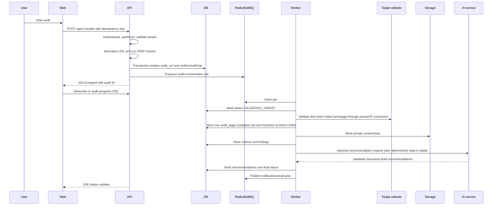
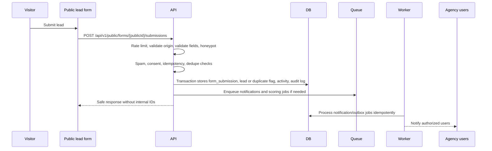
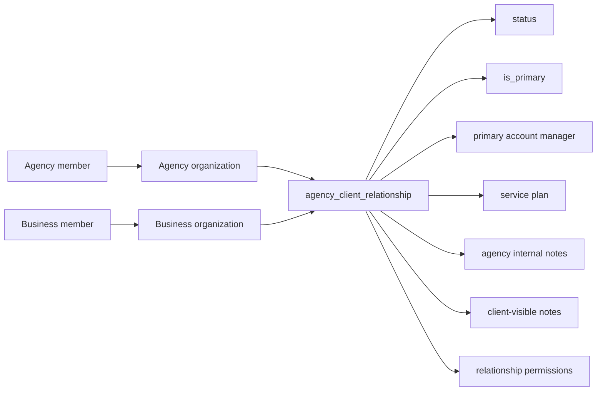
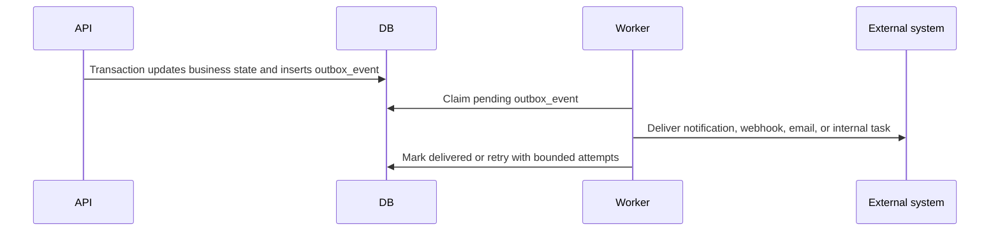

# Data Flow

## Primary Audit Workflow

## Lead-Capture Workflow

## Agency-Client Relationship

## Data Handling Principles

- All organization-specific records include a tenant owner or an explicit relationship to tenant-owned records.
- Public identifiers for lead forms and tracking do not expose internal organization IDs.
- Background job payloads contain stable IDs and minimal metadata, not sensitive full records.
- Private files are never served through public object URLs. The API authorizes and signs short-lived access.
- AI service inputs are minimized to authorized evidence and verified business context.
- Audit logs record sensitive state transitions without storing secrets or unnecessary personal data.
- The MVP service layer permits only one active agency relationship per business while preserving inactive history; the schema remains many-to-many.

## Outbox Flow

Phase 4C writes an `audit_runs` row, `outbox_events` row, and audit-log event in one transaction.
The dispatcher publishes only audit, website, and organization UUIDs to `audit-orchestration`.
Phase 4D1 consumes the job only when its audit is still queued, revalidates DNS immediately before
each pinned-IP connection, and stores metadata for the registered homepage only. Multi-page crawling
begins in Phase 4D2.
