# Data Model

## Initial Entity Relationship Model

```mermaid
erDiagram
  users ||--o{ sessions : has
  users ||--o{ organization_members : joins
  users ||--o{ organization_invitations : invites
  users ||--o{ audit_logs : acts

  organizations ||--o{ organization_members : has
  organizations ||--o{ organization_invitations : has
  organizations ||--o{ business_profiles : owns
  organizations ||--o{ files : owns
  organizations ||--o{ audit_logs : scopes
  organizations ||--o{ usage_records : records

  organizations ||--o{ agency_client_relationships : agency
  organizations ||--o{ agency_client_relationships : business

  business_profiles ||--o{ business_locations : has
  business_profiles ||--o{ business_services : offers
  business_profiles ||--o{ business_hours : publishes
  business_profiles ||--o{ business_social_links : links

  organizations ||--o{ websites : business_owner
  websites ||--o{ website_verifications : verifies
  websites ||--o{ audit_runs : audited_by
  audit_runs ||--o{ audit_pages : contains
  audit_runs ||--o{ audit_metrics : measures
  audit_runs ||--o{ audit_findings : finds
  audit_pages ||--o{ audit_findings : page_finding
  audit_runs ||--o{ audit_screenshots : captures
  audit_runs ||--o{ recommendation_sets : generates

  prompt_versions ||--o{ ai_runs : used_by
  ai_runs ||--o{ recommendation_sets : produces
  recommendation_sets ||--o{ recommendations : contains

  organizations ||--o{ lead_forms : has
  lead_forms ||--o{ form_submissions : receives
  organizations ||--o{ leads : owns
  leads ||--o{ lead_activities : has
  leads ||--o{ lead_tasks : has
  leads ||--o{ lead_stage_history : tracks
  pipeline_stages ||--o{ leads : current_stage

  organizations ||--o{ projects : agency
  organizations ||--o{ projects : business
  projects ||--o{ milestones : has
  projects ||--o{ project_tasks : has
  projects ||--o{ content_requests : has
  content_requests ||--o{ content_submissions : receives
  content_submissions ||--o{ approvals : requires
  projects ||--o{ comments : discusses

  organizations ||--o{ invoices : bills
  invoices ||--o{ payments : paid_by
  payments ||--o{ payment_events : records

  organizations ||--o{ outbox_events : emits
```

## Core Modelling Rules

- Use UUID primary keys.
- Store timestamps in UTC with explicit `created_at` and `updated_at` where records mutate.
- Add explicit foreign keys and indexes for tenant, relationship, and lookup paths.
- Use unique constraints for normalized email, organization slug, organization membership, public form identifiers, idempotency keys where stored, payment event IDs, and relationship uniqueness where required.
- Store money as integer minor units with explicit currency.
- Store password, reset, verification, and session tokens only as hashes.
- Use status enums for lifecycle-heavy entities.
- Prefer append-oriented history for sensitive state transitions.

## Tenant Isolation Strategy

- Every organization-scoped table includes `organization_id` or references an entity that has an organization owner.
- Cross-organization workflows use explicit linking tables, especially `agency_client_relationships` and `projects`.
- Repositories and services accept tenant context and enforce tenant predicates in every query.
- API route parameters are never trusted as authorization proof.
- Tenant isolation tests must cover direct IDs, nested resources, search, exports, files, webhooks, background jobs, and generated reports.

## Implemented Data Work

Phase 1 created the Prisma foundation without a demonstration table. Phase 2 added the first
product migration for users, sessions, verification and reset tokens, organizations, memberships,
invitations, roles, permissions, and audit logs. The RBAC seed and pending-invitation uniqueness
rule are versioned in a second migration.

## Finalised Modelling Decisions

- Sessions use PostgreSQL as source of truth with optional short-lived Redis acceleration; see [ADR 0004](../adr/0004-auth-opaque-sessions.md).
- Agency-client relationships remain many-to-many, with one active relationship per business during MVP and an `is_primary` concept; see [ADR 0012](../adr/0012-agency-client-relationship-cardinality.md).
- Selected sensitive fields use application-level encryption when their domains are implemented; see [ADR 0014](../adr/0014-application-field-encryption.md).
- Future support access is a separately audited capability and is not part of Phase 2 identity; see [ADR 0015](../adr/0015-platform-support-access.md).
