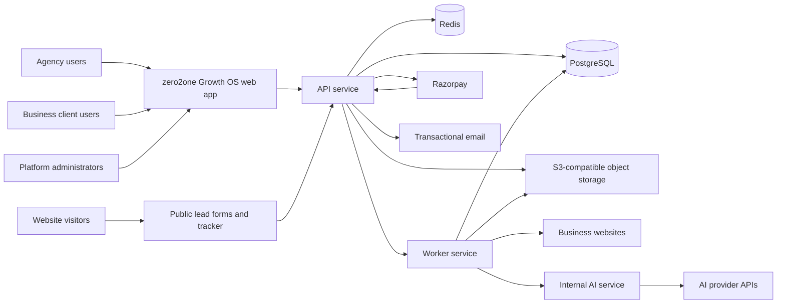
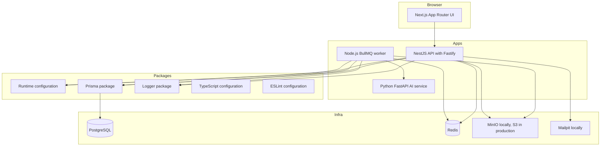

# System Overview

## Architecture Summary

zero2one Growth OS is a multi-tenant SaaS monorepo with a Next.js web application, NestJS REST API, Node.js worker, Python FastAPI AI service, PostgreSQL database, Redis queues/cache, object storage, local Mailpit, and AWS-oriented production infrastructure.

The API is the main authorization boundary. Browser clients do not access databases, object storage credentials, payment-provider secrets, AI-provider secrets, or privileged worker operations directly.

## System Context

## Container Architecture

## Key Boundaries

- Web app: rendering, user interaction, route-level experience, no secrets.
- API: authentication, authorization, validation, tenant context, resource access, OpenAPI, idempotency, audit logs.
- Worker: asynchronous crawling, analysis, screenshots, reports, file validation, email, exports, webhooks, outbox processing.
- AI service: structured AI workflows, prompt versions, provider abstraction, validation, usage/cost metadata.
- PostgreSQL: source of truth for tenant data, audit logs, billing, jobs metadata, and reports.
- Redis: queues, rate limits, short-lived cache, locks, idempotency helpers, and progress.
- Object storage: private files, screenshots, reports, exports, and content submissions.

Only packages with a Phase 1 consumer exist. Contracts, authentication, storage, email, and tracker packages are deferred until their first real domain consumer.

## Phase 3 Domain Boundary

The API now owns agency-client lifecycle, assignment, invitation, business-profile/resource, and
relationship-note operations. Agency requests carry the authenticated active agency organization;
business requests carry the authenticated business organization. Shared business-resource access
requires a verified agency/relationship pair. PostgreSQL constraints complement service checks for
active-relationship cardinality, primary locations, coordinates, pricing, and overlapping hours.
Mailpit delivers local invitations. Redis and object storage remain infrastructure dependencies but
Phase 3 introduces no website-audit queue or object workflow.

## Phase 4B Outbound Security Boundary

Website registration remains metadata-only. The API contains a reusable target validator and
outbound-request policy for a future worker, but exposes no URL-fetch endpoint. The policy uses an
injectable DNS resolver, validates all A/AAAA answers and exposed CNAME aliases, blocks unsafe IP
ranges, and returns only validated-IP connection targets with original-host SNI/Host metadata.
Actual crawling, socket use, redirect following, and response handling remain future work.

## Initial Technology Decisions

- Monorepo: pnpm workspaces and Turborepo.
- Frontend: Next.js App Router, React, TypeScript, Tailwind CSS, shadcn/ui.
- Backend API: NestJS, Fastify adapter, Prisma, PostgreSQL.
- Worker: Node.js, TypeScript, BullMQ, Redis.
- AI service: Python 3.12+, FastAPI, Pydantic, Ruff, mypy, pytest.
- Local infra: Docker Compose for PostgreSQL, Redis, MinIO, Mailpit, and observability dependency if needed.
- Production target: AWS ECS Fargate, ALB, RDS PostgreSQL, ElastiCache Redis, S3, CloudFront where appropriate, SES, Secrets Manager, CloudWatch, ECR, Terraform.

## Phase 1 Health Endpoints

Phase 1 should create basic liveness and readiness endpoints:

- API: `/api/v1/health/live`, `/api/v1/health/ready`.
- Worker: health command or HTTP endpoint exposing queue and dependency state.
- AI service: `/health/live`, `/health/ready`.

The AI readiness endpoint reports whether optional provider configuration is present but does not call OpenAI or require credentials in Phase 1.
